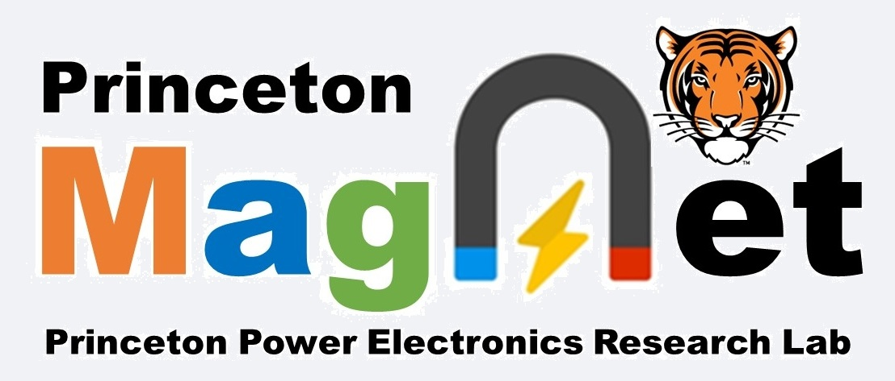

Princeton MagNet is a large-scale dataset designed to enable researchers to model magnetic core loss using machine learning to accelerate the design process of power electronics. The dataset contains a large amount of voltage and current data of different magnetic components with different shapes of waveforms and different properties measured in the real world. Researchers may use these data as pairs of excitations and responses to build up analytical magnetic models or calculate the core loss to derive static models.

## Website

Princeton MagNet is currently deployed at https://mag-net.princeton.edu/

## MagNet Challenge [Link](https://github.com/minjiechen/magnetchallenge)

[Download the Latest Version of the MagNet Handbook (03-25-2023)](magnetchallenge/handbook.pdf)

## Documentation

The web application for Princeton MagNet uses the `magnet` package, a python package under development where most of
the functionality is exposed. Before `magnet` is released on PyPI, it can be installed using
`pip install git+https://github.com/PrincetonUniversity/magnet`.

Please `pip install mag-net` and `pip install .` in the magnet folder before running streamlit.

## How to Cite

If you used MagNet, please cite us with the following.

- D. Serrano et al., "Why MagNet: Quantifying the Complexity of Modeling Power Magnetic Material Characteristics," in IEEE Transactions on Power Electronics, doi: 10.1109/TPEL.2023.3291084. [Paper](https://ieeexplore.ieee.org/document/10169101)

- H. Li et al., "How MagNet: Machine Learning Framework for Modeling Power Magnetic Material Characteristics," in IEEE Transactions on Power Electronics, doi: 10.1109/TPEL.2023.3309232. [Paper](https://ieeexplore.ieee.org/document/10232863)

- H. Li, D. Serrano, S. Wang and M. Chen, "MagNet-AI: Neural Network as Datasheet for Magnetics Modeling and Material Recommendation," in IEEE Transactions on Power Electronics, doi: 10.1109/TPEL.2023.3309233. [Paper](https://ieeexplore.ieee.org/document/10232911)

## Team Members

Princeton MagNet is currently maintained by the Power Electronics Research Lab as Princeton University. We also collaborate with Dartmouth College, and Plexim.

## Sponsors

This work is sponsored by the ARPA-E DIFFERENTIATE Program, Princeton CSML DataX program, Princeton Andlinger Center for Energy and the Environment, and National Science Foundation under the NSF CAREER Award. 

