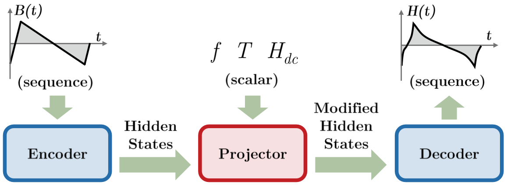

## Tutorial

Here we provide a few step-by-step tutorials to explain how MagNet AI work. 

For PyTorch beginners, we recommend using [Google Golab](https://colab.research.google.com/)(free) to simplify the learning process.

## Overview: Encoder-projector-decoder Neural Network Architecture

Figure below illustrates the structure and the data flow of an encoder-projector-decoder neural network architecture. The general concept of the encoder-projector-decoder architecture is to map a time series into another time series while mixing other information about the operating conditions. As an example, we select $B(t)$ as the input sequence and $H(t)$ as the output sequence. Waveforms of $B(t)$ and $H(t)$ define the basic shape of hysteresis loops. The $B-H$ loops are also significantly affected by other scalar inputs, including the frequency $f$, the temperature $T$, and the dc bias $H_{dc}$. Therefore, an additional projector is implemented between the encoder and the decoder to take these scalar inputs into consideration and predict the $B-H$ loop under different operating conditions.

The encoder takes the $B(t)$ sequence as input and maps the sequence into a vector of fixed dimension. It captures the sequential information and temporal correlation within the sequence, such as the shape, the sequence of the patterns, the amplitude, and the relative changing rate of the given excitation waveform. The output of the encoder is the hidden state vectors, which encapsulate all the necessary information extracted from the input sequence and map it to a domain with hidden states. 

The hidden state vectors are then fed into the projector and modified based on the additional scalar inputs (frequency $f$, temperature $T$, and dc bias $H_{dc}$). The rationale behind the projector is that the shape of $B-H$ loop is not only determined by the shape of $B(t)$ sequence itself, but also by many other factors. 

Finally, the modified hidden state vectors are processed by the decoder, where the decoder makes predictions of the output sequence $H(t)$. During the model inference, the expected response sequence is generated in an auto-regressive way, which means the prediction of each step is produced based on both the current hidden states vectors and all the predictions that are already produced, such that the temporal information of the sequence is retained and reconstructed sequentially while maintain time causality.

The encoder and the decoder can be implemented in various ways, for instance, recurrent neural networks (RNN), attention-based networks (transformer), long-short-term-memory network (LSTM), or convolutional neural networks (CNN), all of which have been proved successful in processing sequential data with sophisticated temporal correlations, and impacted by many factors. Here we show the training and testing of a transformer-based model and an LSTM-based model as examples.

